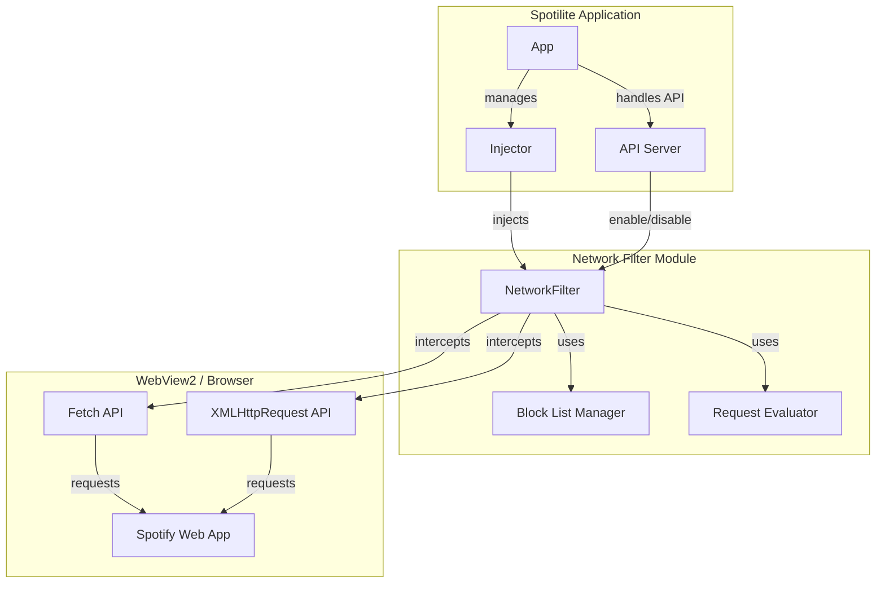

# Design Document: Network Ad Filter

## Overview

The Network Ad Filter is a network-level ad blocking system for Spotilite that intercepts HTTP/HTTPS requests at the WebView2 layer before they reach the Spotify web application. Unlike the current AdBlock module which uses CSS/JS injection to hide ad elements after they load, this approach prevents ad resources from loading entirely, eliminating visual glitches, performance overhead, and DOM manipulation issues.

### Key Design Principles

1. **Network-Level Interception**: Block requests before they complete, not after rendering
2. **Zero DOM Manipulation**: No CSS injection, no JavaScript injection, no element hiding
3. **Module System Integration**: Seamless integration with existing module architecture
4. **Performance First**: Minimal latency overhead (<10ms per request evaluation)
5. **Fail-Safe Design**: Errors default to allowing requests to prevent breaking Spotify

### Design Challenges and Solutions

**Challenge 1: WebView2 API Access from Wails**

Wails v2 abstracts WebView2 behind its runtime API, which doesn't expose direct access to WebView2's `WebResourceRequested` event. The standard Wails runtime provides `WindowExecJS` for JavaScript execution but no native WebView2 event hooks.

**Solution**: Implement a hybrid approach:
- Use JavaScript-based `fetch` and `XMLHttpRequest` interception (similar to current AdBlock module)
- Enhance with synchronous blocking (return empty responses immediately)
- Design architecture to support future native WebView2 integration if Wails exposes it
- Document the limitation and provide extension points for future enhancement

**Challenge 2: Module Interface Compatibility**

The existing Module interface expects `CSS()`, `JS()`, and `Selectors()` methods, which are designed for DOM manipulation. The NetworkFilter doesn't manipulate the DOM.

**Solution**: 
- Implement Module interface with empty `CSS()` and `Selectors()` returns
- Use `JS()` to inject network interception code (not DOM manipulation)
- Add internal methods for block list management that aren't part of Module interface
- Maintain semantic compatibility while extending functionality

## Architecture

### Component Diagram



### System Architecture

The NetworkFilter operates at the JavaScript runtime level within the WebView2 browser context:

1. **Injection Phase**: Injector injects NetworkFilter's JavaScript code into the Spotify web page
2. **Interception Phase**: NetworkFilter wraps native `fetch` and `XMLHttpRequest` APIs
3. **Evaluation Phase**: Each network request is evaluated against the block list
4. **Action Phase**: Blocked requests return empty responses; allowed requests proceed normally

### Integration with Existing Systems

**Module System Integration**:
```
DefaultModules() []Module
├── AdBlockModule (deprecated, to be disabled when NetworkFilter is enabled)
├── SectionBlockModule
├── PremiumSpoofModule
├── ExperimentModule
├── HistoryModule
└── NetworkFilterModule (new)
```

**API Server Integration**:
```
POST /api/spotx/module
{
  "module": "network_filter",
  "enabled": true
}
```

## Components and Interfaces

### NetworkFilterModule

The main module component that implements the Module interface.

```go
package modules

type NetworkFilterModule struct {
    BaseModule
    blockList []string
    mu        sync.RWMutex
}

func NewNetworkFilterModule(enabled bool) *NetworkFilterModule {
    return &NetworkFilterModule{
        BaseModule: BaseModule{
            name:    "network_filter",
            enabled: enabled,
        },
        blockList: defaultBlockList(),
    }
}

// Module interface implementation
func (m *NetworkFilterModule) Name() string
func (m *NetworkFilterModule) Enabled() bool
func (m *NetworkFilterModule) SetEnabled(bool)
func (m *NetworkFilterModule) CSS() string      // Returns empty string
func (m *NetworkFilterModule) JS() string       // Returns network interception code
func (m *NetworkFilterModule) Selectors() []string // Returns empty slice

// Block list management (internal API)
func (m *NetworkFilterModule) AddPattern(pattern string)
func (m *NetworkFilterModule) RemovePattern(pattern string)
func (m *NetworkFilterModule) GetBlockList() []string
func (m *NetworkFilterModule) SetBlockList(patterns []string)
```

**Key Design Decisions**:
- `CSS()` returns empty string (no DOM styling)
- `Selectors()` returns empty slice (no element hiding)
- `JS()` returns network interception code (not DOM manipulation)
- Block list is thread-safe with `sync.RWMutex`
- Block list modifications take effect on next injection cycle

### Block List Manager

Manages the list of ad domain patterns to block.

**Data Structure**:
```go
type BlockList struct {
    patterns []string
    mu       sync.RWMutex
}
```

**Default Patterns**:
```go
var defaultBlockList = []string{
    "ads.spotify.com",
    "spclient.wg.spotify.com/ads",
    "audio-ads.spotify.com",
    "ads-audio.spotify.com",
    "ad-logger.spotify.com",
    "pubads.g.doubleclick.net",
    "doubleclick.net",
    "googlesyndication.com",
    "moatads.com",
    "/ad/",
    "/ads/",
}
```

**Pattern Matching Strategy**:
- Case-insensitive substring matching
- Support for domain patterns (e.g., `doubleclick.net`)
- Support for path patterns (e.g., `/ads/`)
- Whitelist protection for legitimate Spotify domains

### Request Evaluator (JavaScript)

The JavaScript component that evaluates requests against the block list.

**Core Functions**:
```javascript
function isAdUrl(url) {
    // Evaluate URL against block list patterns
    // Return true if URL matches any ad pattern
    // Return false otherwise
}

function createEmptyResponse() {
    // Return empty HTTP 200 response
    return new Response('{}', {
        status: 200,
        headers: { 'Content-Type': 'application/json' }
    });
}

function createEmptyAudioResponse() {
    // Return empty audio response for audio ad requests
    return new Response(new ArrayBuffer(0), {
        status: 200,
        headers: { 'Content-Type': 'audio/mpeg' }
    });
}
```

**Interception Strategy**:
```javascript
// Wrap native fetch API
const originalFetch = window.fetch;
window.fetch = function(url, options) {
    if (isAdUrl(url)) {
        console.log('[NetworkFilter] Blocked:', url);
        return Promise.resolve(createEmptyResponse());
    }
    return originalFetch.apply(this, arguments);
};

// Wrap XMLHttpRequest
const originalOpen = XMLHttpRequest.prototype.open;
XMLHttpRequest.prototype.open = function(method, url) {
    if (isAdUrl(url)) {
        this._blocked = true;
        console.log('[NetworkFilter] Blocked XHR:', url);
        return;
    }
    return originalOpen.apply(this, arguments);
};
```

## Data Models

### NetworkFilterModule State

```go
type NetworkFilterModule struct {
    BaseModule
    blockList []string      // List of URL patterns to block
    mu        sync.RWMutex  // Protects blockList
}
```

**State Transitions**:
```
[Disabled] --SetEnabled(true)--> [Enabled]
[Enabled] --SetEnabled(false)--> [Disabled]
[Enabled] --AddPattern()--> [Enabled with updated list]
[Enabled] --RemovePattern()--> [Enabled with updated list]
```

### Block List Entry

```go
type BlockPattern struct {
    Pattern string  // The pattern to match (e.g., "doubleclick.net")
    Type    string  // "domain" or "path"
}
```

**Pattern Types**:
- **Domain patterns**: Match anywhere in hostname (e.g., `doubleclick.net` matches `pubads.g.doubleclick.net`)
- **Path patterns**: Match in URL path (e.g., `/ads/` matches `https://spotify.com/ads/banner`)

### Request Context

```javascript
// JavaScript-side request context
{
    url: string,           // Full request URL
    method: string,        // HTTP method (GET, POST, etc.)
    isBlocked: boolean,    // Whether request matches block list
    matchedPattern: string // Which pattern matched (for logging)
}
```

## Error Handling

### Error Handling Strategy

**Principle**: Fail open, not closed. Network filtering errors should never break Spotify functionality.

### Error Scenarios and Responses

| Error Scenario | Response | Logging |
|---------------|----------|---------|
| Pattern matching fails | Allow request | ERROR level |
| Block list is empty | Allow all requests | INFO level |
| JavaScript injection fails | Spotify loads normally | ERROR level |
| Request evaluation throws exception | Allow request | ERROR level |
| Invalid pattern added to block list | Ignore pattern | WARN level |

### Error Handling Implementation

```go
func (m *NetworkFilterModule) AddPattern(pattern string) error {
    if pattern == "" {
        slog.Warn("attempted to add empty pattern to block list")
        return fmt.Errorf("pattern cannot be empty")
    }
    
    m.mu.Lock()
    defer m.mu.Unlock()
    
    // Validate pattern
    if !isValidPattern(pattern) {
        slog.Warn("invalid pattern rejected", "pattern", pattern)
        return fmt.Errorf("invalid pattern: %s", pattern)
    }
    
    m.blockList = append(m.blockList, pattern)
    slog.Info("pattern added to block list", "pattern", pattern)
    return nil
}
```

```javascript
// JavaScript error handling
function isAdUrl(url) {
    try {
        // Pattern matching logic
        for (const pattern of AD_PATTERNS) {
            if (url.toLowerCase().includes(pattern.toLowerCase())) {
                return true;
            }
        }
        return false;
    } catch (e) {
        console.error('[NetworkFilter] Error evaluating URL:', e);
        // Fail open: allow request on error
        return false;
    }
}
```

### Logging Strategy

**Log Levels**:
- **INFO**: Module enable/disable, successful blocks, initialization
- **WARN**: Invalid patterns, configuration issues
- **ERROR**: Injection failures, evaluation errors, critical failures

**Log Format**:
```
[NetworkFilter] <action>: <details>
```

**Examples**:
```
INFO  [NetworkFilter] Blocked: https://ads.spotify.com/banner.jpg (matched: ads.spotify.com)
INFO  [NetworkFilter] Module enabled
WARN  [NetworkFilter] Invalid pattern rejected: ""
ERROR [NetworkFilter] Failed to evaluate request: <error details>
```

## Testing Strategy

### Testing Approach

This feature is **NOT suitable for property-based testing** because:
1. It involves network interception with side effects (blocking requests)
2. It depends on WebView2 browser behavior and JavaScript runtime
3. It requires integration with the Spotify web application
4. The "correctness" depends on external ad server behavior

**Appropriate Testing Strategies**:
- **Unit tests**: Test block list management, pattern matching logic
- **Integration tests**: Test module lifecycle, API endpoints
- **Manual tests**: Test actual ad blocking in running application
- **Mock-based tests**: Test request interception with mocked fetch/XHR

### Unit Tests

**Block List Management**:
```go
func TestAddPattern(t *testing.T)
func TestRemovePattern(t *testing.T)
func TestGetBlockList(t *testing.T)
func TestSetBlockList(t *testing.T)
func TestAddEmptyPattern(t *testing.T)
func TestAddDuplicatePattern(t *testing.T)
```

**Pattern Matching**:
```go
func TestIsAdUrl_DomainPattern(t *testing.T)
func TestIsAdUrl_PathPattern(t *testing.T)
func TestIsAdUrl_CaseInsensitive(t *testing.T)
func TestIsAdUrl_WhitelistedDomain(t *testing.T)
func TestIsAdUrl_EmptyBlockList(t *testing.T)
```

**Module Interface**:
```go
func TestNetworkFilterModule_Name(t *testing.T)
func TestNetworkFilterModule_Enabled(t *testing.T)
func TestNetworkFilterModule_SetEnabled(t *testing.T)
func TestNetworkFilterModule_CSS_ReturnsEmpty(t *testing.T)
func TestNetworkFilterModule_Selectors_ReturnsEmpty(t *testing.T)
func TestNetworkFilterModule_JS_ReturnsCode(t *testing.T)
```

### Integration Tests

**API Integration**:
```go
func TestAPIServer_EnableNetworkFilter(t *testing.T)
func TestAPIServer_DisableNetworkFilter(t *testing.T)
func TestAPIServer_GetNetworkFilterStatus(t *testing.T)
```

**Module Integration**:
```go
func TestInjector_RegistersNetworkFilter(t *testing.T)
func TestInjector_InjectsNetworkFilterJS(t *testing.T)
func TestNetworkFilter_DisablesAdBlockModule(t *testing.T)
```

### Manual Testing Checklist

- [ ] Enable NetworkFilter via API
- [ ] Verify audio ads are blocked during playback
- [ ] Verify banner ads are not loaded
- [ ] Verify Spotify UI remains functional
- [ ] Verify no visual glitches or flickering
- [ ] Verify legitimate Spotify content loads normally
- [ ] Disable NetworkFilter and verify ads return
- [ ] Check browser console for blocked request logs
- [ ] Verify performance (page load time, request latency)
- [ ] Test on Windows 10 and Windows 11

### Test Data

**Test URLs**:
```go
var testAdUrls = []string{
    "https://ads.spotify.com/banner.jpg",
    "https://spclient.wg.spotify.com/ads/v1/config",
    "https://audio-ads.spotify.com/audio/ad123.mp3",
    "https://pubads.g.doubleclick.net/gampad/ads",
}

var testLegitimateUrls = []string{
    "https://open.spotify.com/track/123",
    "https://api.spotify.com/v1/me/player",
    "https://scdn.co/image/abc123",
    "https://audio-sp.spotify.com/audio/track456.mp3",
}
```

## Implementation Plan

### Phase 1: Core Module Implementation

**Tasks**:
1. Create `network_filter.go` in `internal/spotify/modules/`
2. Implement `NetworkFilterModule` struct with Module interface
3. Implement block list management methods
4. Write unit tests for block list operations
5. Add NetworkFilter to `DefaultModules()` in injector

**Deliverables**:
- `internal/spotify/modules/network_filter.go`
- `internal/spotify/modules/network_filter_test.go`
- Updated `internal/spotify/injector.go`

### Phase 2: JavaScript Interception Code

**Tasks**:
1. Write JavaScript code for fetch/XHR interception
2. Implement pattern matching logic in JavaScript
3. Add logging for blocked requests
4. Test interception code in browser console
5. Integrate JavaScript code into `JS()` method

**Deliverables**:
- JavaScript interception code in `network_filter.go`
- Browser console testing results

### Phase 3: API Integration

**Tasks**:
1. Update API server to support NetworkFilter enable/disable
2. Add endpoint to get NetworkFilter status
3. Update `GetSpotXSettings()` to include NetworkFilter state
4. Write integration tests for API endpoints
5. Test API endpoints with curl/Postman

**Deliverables**:
- Updated `internal/api/server.go`
- Updated `internal/app/app.go`
- API integration tests

### Phase 4: AdBlock Module Deprecation

**Tasks**:
1. Add logic to disable AdBlock when NetworkFilter is enabled
2. Update module initialization to prefer NetworkFilter
3. Add migration path for existing users
4. Document the change in FEATURES.md
5. Test both modules don't run simultaneously

**Deliverables**:
- Updated module initialization logic
- Updated documentation
- Migration guide

### Phase 5: Testing and Validation

**Tasks**:
1. Run all unit tests
2. Run all integration tests
3. Perform manual testing checklist
4. Test on Windows 10 and Windows 11
5. Performance testing (measure request latency)
6. Fix any bugs discovered during testing

**Deliverables**:
- Test results report
- Performance metrics
- Bug fixes

### Phase 6: Documentation and Deployment

**Tasks**:
1. Update ARCHITECTURE.md with NetworkFilter design
2. Update FEATURES.md with NetworkFilter feature
3. Add usage examples to README.md
4. Create release notes
5. Build and test release binary

**Deliverables**:
- Updated documentation
- Release notes
- Release binary

## Performance Considerations

### Latency Requirements

**Target**: <10ms per request evaluation

**Measurement Points**:
- Pattern matching time
- JavaScript execution time
- Request interception overhead

### Optimization Strategies

1. **Pattern Matching Optimization**:
   - Use simple substring matching (not regex) for speed
   - Cache compiled patterns if regex is needed
   - Short-circuit evaluation (return on first match)

2. **JavaScript Optimization**:
   - Minimize string operations
   - Use array methods efficiently
   - Avoid unnecessary object creation

3. **Block List Optimization**:
   - Keep block list small (<50 patterns)
   - Order patterns by frequency (most common first)
   - Use Set for O(1) lookup if needed

### Memory Considerations

**Memory Usage**:
- Block list: ~1KB (50 patterns × 20 bytes average)
- JavaScript code: ~5KB (injected once)
- Runtime overhead: Minimal (no DOM storage)

**Memory Optimization**:
- No DOM element tracking (unlike AdBlock module)
- No mutation observers
- No interval timers
- Minimal JavaScript heap usage

### Performance Monitoring

**Metrics to Track**:
- Average request evaluation time
- Number of requests blocked per session
- Page load time impact
- Memory usage over time

**Logging Performance Data**:
```javascript
const startTime = performance.now();
const isBlocked = isAdUrl(url);
const duration = performance.now() - startTime;

if (duration > 5) {
    console.warn('[NetworkFilter] Slow evaluation:', duration, 'ms');
}
```

## Security Considerations

### Threat Model

**Threats**:
1. **Ad servers bypass block list**: New ad domains not in block list
2. **Malicious patterns**: User adds patterns that block legitimate content
3. **JavaScript injection attacks**: Malicious code in pattern strings
4. **Performance DoS**: Extremely large block list causes slowdown

**Mitigations**:
1. Regular block list updates
2. Pattern validation before adding to block list
3. Sanitize all pattern strings
4. Limit block list size (max 100 patterns)

### Input Validation

**Pattern Validation**:
```go
func isValidPattern(pattern string) bool {
    // Reject empty patterns
    if pattern == "" {
        return false
    }
    
    // Reject patterns with control characters
    for _, r := range pattern {
        if r < 32 || r == 127 {
            return false
        }
    }
    
    // Reject patterns that would block everything
    if pattern == "*" || pattern == "." {
        return false
    }
    
    // Reject patterns that would block Spotify
    blockedDomains := []string{"open.spotify.com", "api.spotify.com"}
    for _, domain := range blockedDomains {
        if strings.Contains(pattern, domain) {
            return false
        }
    }
    
    return true
}
```

### Whitelist Protection

**Protected Domains**:
```go
var protectedDomains = []string{
    "open.spotify.com",
    "api.spotify.com",
    "scdn.co",
    "spotify.com/track",
    "spotify.com/album",
    "spotify.com/playlist",
    "spotify.com/artist",
}
```

**Whitelist Check**:
```javascript
function isProtectedUrl(url) {
    const PROTECTED = [
        'open.spotify.com',
        'api.spotify.com',
        'scdn.co',
        '/track/',
        '/album/',
        '/playlist/',
        '/artist/'
    ];
    
    for (const pattern of PROTECTED) {
        if (url.includes(pattern)) {
            return true;
        }
    }
    return false;
}

function isAdUrl(url) {
    // Always allow protected URLs
    if (isProtectedUrl(url)) {
        return false;
    }
    
    // Check against block list
    // ...
}
```

## Deployment Considerations

### Compatibility Requirements

**Operating Systems**:
- Windows 10 version 1809 or later
- Windows 11 (all versions)

**WebView2 Runtime**:
- Minimum version: 86.0.616.0
- Recommended: Latest stable version

**Wails Version**:
- Wails v2.12 or later

### Configuration

**Default Configuration**:
```go
// NetworkFilter is enabled by default
func DefaultModules() []modules.Module {
    return []modules.Module{
        modules.NewNetworkFilterModule(true),  // New, enabled
        modules.NewAdBlockModule(false),       // Deprecated, disabled
        modules.NewSectionBlockModule(true),
        modules.NewPremiumSpoofModule(true),
        modules.NewExperimentModule(true),
        modules.NewHistoryModule(true),
    }
}
```

**User Configuration** (via API):
```bash
# Enable NetworkFilter
curl -X POST http://localhost:8765/api/spotx/module \
  -H "Content-Type: application/json" \
  -d '{"module": "network_filter", "enabled": true}'

# Disable NetworkFilter
curl -X POST http://localhost:8765/api/spotx/module \
  -H "Content-Type: application/json" \
  -d '{"module": "network_filter", "enabled": false}'
```

### Migration from AdBlock Module

**Migration Strategy**:
1. NetworkFilter is enabled by default in new installations
2. Existing users with AdBlock enabled will see both modules initially
3. On first run with NetworkFilter, AdBlock is automatically disabled
4. Users can manually re-enable AdBlock if NetworkFilter doesn't work

**Migration Code**:
```go
func (a *App) Startup(ctx context.Context) {
    // ... existing startup code ...
    
    // Migrate from AdBlock to NetworkFilter
    networkFilter := a.injector.GetModule("network_filter")
    adBlock := a.injector.GetModule("adblock")
    
    if networkFilter != nil && networkFilter.Enabled() {
        if adBlock != nil && adBlock.Enabled() {
            slog.Info("disabling AdBlock in favor of NetworkFilter")
            adBlock.SetEnabled(false)
        }
    }
}
```

### Rollback Plan

If NetworkFilter causes issues:

1. **Immediate Rollback** (via API):
   ```bash
   curl -X POST http://localhost:8765/api/spotx/module \
     -d '{"module": "network_filter", "enabled": false}'
   
   curl -X POST http://localhost:8765/api/spotx/module \
     -d '{"module": "adblock", "enabled": true}'
   ```

2. **Code Rollback**:
   - Remove NetworkFilter from `DefaultModules()`
   - Re-enable AdBlock by default
   - Keep NetworkFilter code for future use

3. **User Communication**:
   - Document rollback procedure in README
   - Add troubleshooting section to FEATURES.md
   - Provide clear error messages if NetworkFilter fails

## Future Enhancements

### Native WebView2 Integration

**Goal**: Use WebView2's native `WebResourceRequested` event instead of JavaScript interception.

**Approach**:
1. Research Wails v3 or custom WebView2 bindings
2. Implement Go-side WebView2 event handler
3. Register filter with `AddWebResourceRequestedFilter`
4. Handle `WebResourceRequested` events in Go code
5. Call `PutResponse` with empty response for blocked requests

**Benefits**:
- True network-level blocking (before request is sent)
- Better performance (no JavaScript overhead)
- More reliable (can't be bypassed by page JavaScript)
- Lower memory usage

**Challenges**:
- Requires Wails to expose WebView2 API
- May require CGo or Windows API calls
- Platform-specific code (Windows only)

### Dynamic Block List Updates

**Goal**: Update block list from remote source without recompiling.

**Approach**:
1. Add HTTP client to fetch block list from URL
2. Implement block list versioning
3. Add automatic update check on startup
4. Cache block list locally
5. Provide API endpoint to trigger manual update

**Benefits**:
- Users get new ad patterns automatically
- No need to release new version for block list updates
- Community can contribute patterns

### Pattern Syntax Extensions

**Goal**: Support more sophisticated pattern matching.

**Approach**:
1. Add regex pattern support (with performance safeguards)
2. Add wildcard patterns (`*.doubleclick.net`)
3. Add exception patterns (allow specific URLs)
4. Add pattern priority/ordering

**Example**:
```go
type BlockPattern struct {
    Pattern   string
    Type      PatternType  // Substring, Regex, Wildcard
    Action    Action       // Block, Allow
    Priority  int
}
```

### Performance Analytics

**Goal**: Provide users with ad blocking statistics.

**Approach**:
1. Track number of requests blocked
2. Track bandwidth saved
3. Track most common ad domains
4. Provide API endpoint to get statistics
5. Display statistics in UI

**Example API Response**:
```json
{
  "totalBlocked": 1234,
  "bandwidthSaved": "15.2 MB",
  "topBlockedDomains": [
    {"domain": "doubleclick.net", "count": 456},
    {"domain": "ads.spotify.com", "count": 234}
  ],
  "sessionDuration": "2h 15m"
}
```

## Appendix

### References

- [Microsoft Edge WebView2 Documentation](https://learn.microsoft.com/en-us/microsoft-edge/webview2/)
- [WebResourceRequested Event](https://learn.microsoft.com/en-us/microsoft-edge/webview2/how-to/webresourcerequested)
- [Wails v2 Documentation](https://wails.io/docs/)
- [Spotilite Architecture](../../docs/ARCHITECTURE.md)

### Glossary

- **WebView2**: Microsoft Edge WebView2 control for embedding web content in native applications
- **WebResourceRequested**: WebView2 event fired before loading a web resource
- **Fetch API**: Modern JavaScript API for making HTTP requests
- **XMLHttpRequest**: Legacy JavaScript API for making HTTP requests
- **Module**: Spotilite's plugin system for extending functionality
- **Injector**: Component that injects module code into the Spotify web page
- **Block List**: List of URL patterns to block
- **Pattern Matching**: Process of comparing URLs against block list patterns

### Acronyms

- **API**: Application Programming Interface
- **CSS**: Cascading Style Sheets
- **DOM**: Document Object Model
- **HTTP**: Hypertext Transfer Protocol
- **HTTPS**: HTTP Secure
- **JS**: JavaScript
- **URL**: Uniform Resource Locator
- **XHR**: XMLHttpRequest

### Change Log

| Version | Date | Author | Changes |
|---------|------|--------|---------|
| 1.0 | 2025-01-XX | Kiro | Initial design document |
